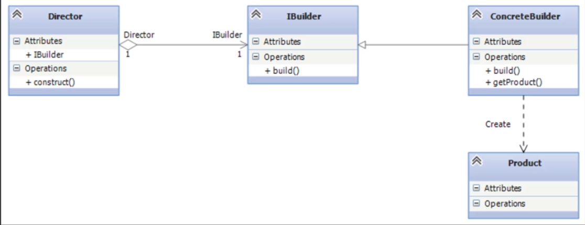

## Builder

Builder es un patrón de diseño de tipo creacional, ya que te proporciona una ayuda para la creación de un objeto

Este patrón funciona cuando se tienen objetos que tienen muchos elementos en su construcción ya que lo que hace es separar el constructor en un conjunto de métodos encadenados, estos métodos encadenados se pueden invocar o no por lo que va haciendo un encadenamiento de métodos dependiendo la construcción del objeto.

Practicamente este patron te permite crear objetos de distintas presentaciones en lugar de haber invocado todos los parametros, por ejemplo: se tiene un constructor donde se recibe 10 parametros y solo se cuenta con algunos de ellos, el patron builder te permite crear el objeto con los parametros que tienes sin necesidad de llenar los parametros faltantes como lo seria con un null, un string vacio, etc.

Este patron tambien cuenta con la parte del Director el cual sirve como reseta, practicamente te simplifica paso a la hora de crear el objeto con ciertos parametros, esto hace que no se creen objetos con los valores que quieras sino que te va diciendo los datos que se van necesitando dependiendo el uso.