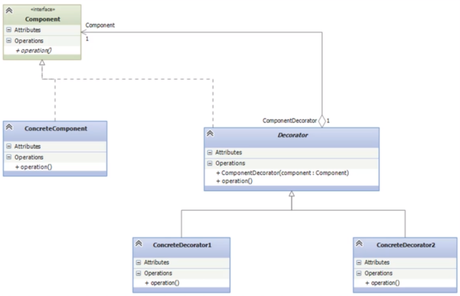

## Decorator

Decorator es un patrón de diseño de tipo estructura, ya que te proporciona una ayuda para la estructura que tienen las clases, este patron vienen a solucionar cuando se tiene que agregar mucha funcionalidad jerárquicamente a un conjunto de clases

Este patrón funciona cuando por ejemplo se tiene una clase padre, la cual heredamos a un hijo para asi agregar mas funcionalidad, por lo cual se hace una nueva herencia sobre el hijo y asi sucesivamente por lo que el decorador lo que hace es reducir este tipo de jerarquización haciendo envoltorios de funcionalidad.

Se le llama un envoltorio de funcionalidad cuando se tiene una funcionalidad de la clase principal y se quiere agregar funciones extras a esto que ya existe en lugar de heredar, el envolotorio termina ejecutando la funcionalidad de la clase principal mas la funcionalidad extra 

