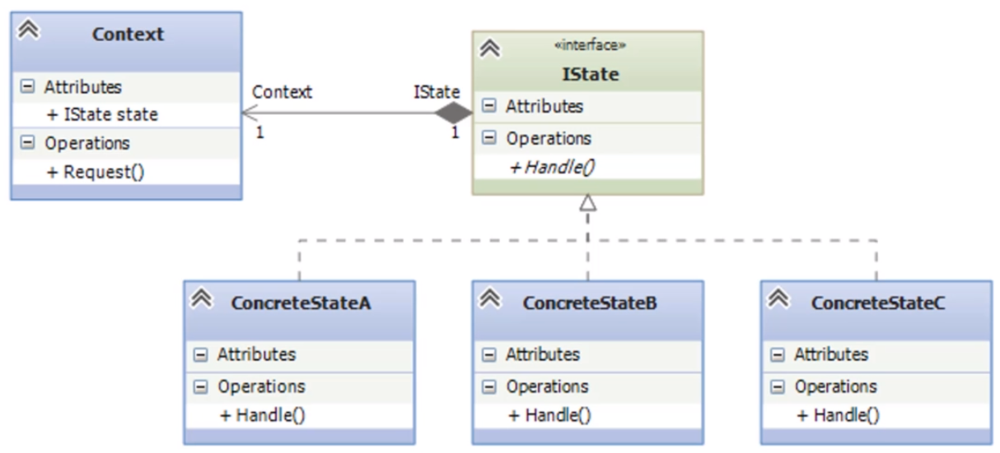

## State

State es un patrón de diseño de tipo comportamiento, State es un patrón de diseño de comportamiento que permite a un objeto alterar su comportamiento cuando su estado interno cambia. Parece como si el objeto cambiara su clase.

Este patron funciona cuando se tiene un contexto el cual puede tener un estado establecido y dependiedo de este estado va a ser su comportamiento, la idea principal es que, en cualquier momento dado, un programa puede encontrarse en un número finito de estados. Dentro de cada estado único, el programa se comporta de forma diferente y puede cambiar de un estado a otro instantáneamente. Sin embargo, dependiendo de un estado actual, el programa puede cambiar o no a otros estados. Estas normas de cambio llamadas transiciones también son finitas y predeterminadas.
